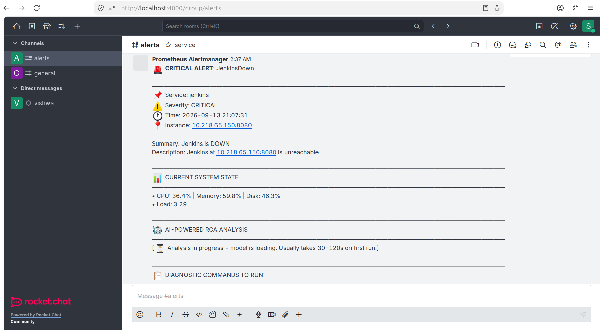
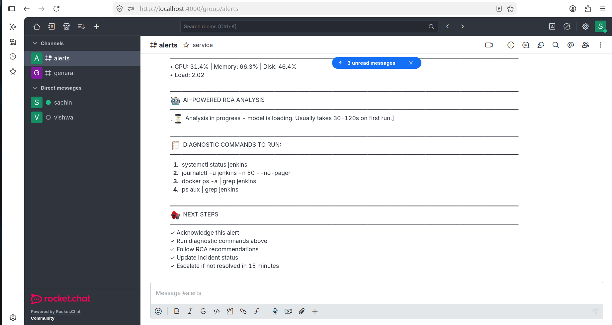

# 🤖 AI-SRE Platform

An AI-powered Site Reliability Engineering platform that automatically detects infrastructure and service incidents, collects metrics and logs, performs AI-assisted Root Cause Analysis (RCA) using a local LLM with Ollama, and sends actionable incident reports to Rocket.Chat.

Built completely on a **local Linux/Docker environment** with no cloud dependency and no Kubernetes.


---

## 📐 Architecture

```text
                         AI-SRE PLATFORM
                              │
                              │
                    ┌─────────▼─────────┐
                    │    Prometheus     │
                    │       :9090       │
                    │                   │
                    │ Metrics + Rules   │
                    └─────────┬─────────┘
                              │
                         Alert Fired
                              │
                              ▼
                    ┌───────────────────┐
                    │   Alertmanager    │
                    │       :9093       │
                    │                   │
                    │ Routing + Alerts  │
                    └─────────┬─────────┘
                              │
                         Webhook
                              │
                              ▼
              ┌─────────────────────────────┐
              │       AI-SRE Engine         │
              │           :5000             │
              │                             │
              │  1. Receive Alert           │
              │  2. Identify Incident       │
              │  3. Collect Metrics         │
              │  4. Query Loki Logs         │
              │  5. Analyze with AI         │
              │  6. Generate RCA             │
              │  7. Generate Recovery       │
              └───────┬──────────┬──────────┘
                      │          │
                 Logs │          │ AI Analysis
                      │          │
                      ▼          ▼
               ┌──────────┐  ┌──────────┐
               │   Loki   │  │  Ollama  │
               │  :3100   │  │  :11434  │
               └────▲─────┘  │ Gemma 3  │
                    │        │   4B     │
                    │        └────┬─────┘
                    │             │
                    │             │ RCA
                    │             ▼
                    │      ┌──────────────┐
                    │      │ Rocket.Chat  │
                    │      │    :4000     │
                    │      │              │
                    │      │ AI Incident  │
                    │      │ Notification │
                    │      └──────────────┘
                    │
              ┌─────┴──────┐
              │  Promtail  │
              │    :9080   │
              └────────────┘


        Host Infrastructure
        ┌──────────────────────────────┐
        │ Node Exporter :9100          │
        │                              │
        │ CPU / Memory / Disk / Load   │
        │ Docker Containers            │
        │ Expected systemd services    │
        └──────────────────────────────┘
```

---

## 🔄 Incident Flow

```text
Infrastructure / Service
          │
          ▼
    Node Exporter
          │
          ▼
     Prometheus
          │
          │ Alert Rule
          ▼
     Alertmanager
          │
          │ Webhook
          ▼
    AI-SRE Engine
          │
          ├──────────────► Prometheus
          │                 System Metrics
          │
          ├──────────────► Loki
          │                 Recent Logs
          │
          ├──────────────► Docker
          │                 Container Status
          │
          ├──────────────► systemd
          │                 Service Status
          │
          ▼
       Ollama
       Gemma 3 4B
          │
          ▼
     AI RCA Report
          │
          ▼
     Rocket.Chat
          │
          ▼
     SRE Incident
```

---

## 🧱 Stack Components

| Component             | Role                                                |  Port |
| --------------------- | --------------------------------------------------- | ----: |
| **Prometheus**        | Metrics collection and alert rule evaluation        |  9090 |
| **Node Exporter**     | Host CPU, memory, disk, load and custom SRE metrics |  9100 |
| **Alertmanager**      | Alert routing and webhook delivery                  |  9093 |
| **Grafana**           | Metrics and log visualization                       |  3000 |
| **Loki**              | Centralized log storage and querying                |  3100 |
| **Promtail**          | System and Docker log collection                    |  9080 |
| **Blackbox Exporter** | HTTP endpoint availability monitoring               |  9115 |
| **Ollama**            | Local LLM runtime                                   | 11434 |
| **Gemma 3 4B**        | Local AI model for RCA                              |     - |
| **AI-SRE Engine**     | Alert processing and AI RCA                         |  5000 |
| **Rocket.Chat**       | Incident notification                               |  4000 |
| **MongoDB**           | Rocket.Chat database                                | 27017 |

---

## 🧠 AI-SRE Engine

The AI-SRE Engine is the main component of this project.

It receives Alertmanager webhooks and automatically performs an incident investigation.

### Investigation Pipeline

```text
Alert Received
      │
      ▼
Identify Alert
      │
      ▼
Identify Target
      │
      ▼
Collect System Metrics
      │
      ▼
Check Docker Container
      │
      ▼
Check systemd Service
      │
      ▼
Query Loki
      │
      ▼
Compact Evidence
      │
      ▼
Send Evidence to Ollama
      │
      ▼
Generate AI RCA
      │
      ▼
Generate Diagnostics
      │
      ▼
Generate Recovery Steps
      │
      ▼
Generate Verification Steps
      │
      ▼
Send to Rocket.Chat
```

---

## 🔍 What AI-SRE Investigates

### System Metrics

Collected through Prometheus / Node Exporter:

* CPU utilization
* Memory utilization
* Disk usage
* Disk I/O
* Network statistics
* Load average
* Host availability

### Docker Containers

The custom SRE exporter monitors Docker containers configured with restart policies such as:

```text
always
unless-stopped
on-failure
```

Example metric:

```text
sre_docker_container_running
```

Example:

```text
sre_docker_container_running{
    id="...",
    name="ollama",
    restart_policy="unless-stopped"
} 1
```

If the container stops:

```text
sre_docker_container_running{
    id="...",
    name="ollama",
    restart_policy="unless-stopped"
} 0
```

---

## ⚙️ Expected systemd Service Monitoring

Instead of alerting on every inactive systemd unit, this project uses an explicit service inventory.

Example:

```text
/etc/ai-sre/expected-services
```

```text
docker.service
containerd.service
ssh.service
apache2.service
snmpd.service
```

The exporter generates:

```text
sre_systemd_service_active
```

Example:

```text
sre_systemd_service_active{
    unit="apache2.service"
} 1
```

If Apache goes down:

```text
sre_systemd_service_active{
    unit="apache2.service"
} 0
```

This avoids false alerts caused by intentionally inactive systemd services.

---

## 📊 Prometheus

Prometheus is responsible for:

* Collecting infrastructure metrics
* Evaluating alert rules
* Detecting service failures
* Detecting resource problems
* Sending alerts to Alertmanager

### Prometheus Configuration

```yaml
global:
  scrape_interval: 15s
  evaluation_interval: 15s

rule_files:
  - /etc/prometheus/alerts.yml

alerting:
  alertmanagers:
    - static_configs:
        - targets:
            - alertmanager:9093

scrape_configs:
  - job_name: sachin
    static_configs:
      - targets:
          - node_exporter:9100
```

---

## 🚨 Alert Rules

### Infrastructure Alerts

| Alert          | Purpose                          | Severity |
| -------------- | -------------------------------- | -------- |
| `HighCPU`      | Detect high CPU utilization      | warning  |
| `HighMemory`   | Detect high memory utilization   | warning  |
| `DiskFull`     | Detect disk exhaustion           | critical |
| `DiskCritical` | Detect critically low disk space | critical |
| `LoadHigh`     | Detect high system load          | warning  |
| `NodeDown`     | Detect host/exporter failure     | critical |

### Service Alerts

| Alert         | Purpose                              | Severity |
| ------------- | ------------------------------------ | -------- |
| `ServiceDown` | Expected systemd service is inactive | critical |
| `DockerDown`  | Expected Docker container is stopped | critical |
| `ApacheDown`  | Apache service is unavailable        | critical |
| `NginxDown`   | Nginx service is unavailable         | critical |

### Application / Monitoring Alerts

| Alert              | Purpose                  | Severity |
| ------------------ | ------------------------ | -------- |
| `PrometheusDown`   | Prometheus unavailable   | critical |
| `GrafanaDown`      | Grafana unavailable      | critical |
| `LokiDown`         | Loki unavailable         | critical |
| `AlertmanagerDown` | Alertmanager unavailable | critical |

---

## 📝 Loki + Promtail

Loki provides centralized log collection for AI-SRE.

Promtail collects:

### System Logs

```text
/var/log/*
```

### Docker Logs

```text
/var/lib/docker/containers/*/*.log
```

### systemd Journal

Promtail also collects systemd journal entries.

Example configuration:

```yaml
- job_name: systemd-journal
  journal:
    path: /var/log/journal

  relabel_configs:
    - source_labels: ['__journal__systemd_unit']
      target_label: service

    - source_labels: ['__journal__hostname']
      target_label: host
```

---

## 🔎 Loki Queries

### systemd Service

```logql
{service="apache2.service"}
```

### Docker Logs

```logql
{job="docker"} |= "ollama"
```

### Error Search

```logql
{job="docker"} |= "error"
```

AI-SRE automatically queries Loki to collect recent evidence related to an incident.

---

## 🤖 Ollama + Local LLM

AI-SRE uses **Ollama** to run the LLM locally.

No external AI API is required.

### Current Model

```text
Gemma 3 4B
```

Model:

```text
gemma3:4b
```

The current environment also exposes:

```text
gemma3:latest
```

---

## 📦 Install Ollama

Create the Ollama container:

```bash
docker run -d \
  --name ollama \
  --restart unless-stopped \
  --network monitoring \
  -p 11434:11434 \
  -v ollama:/root/.ollama \
  ollama/ollama
```

Verify:

```bash
docker ps | grep ollama
```

---

## 📥 Download the AI Model

Pull Gemma 3 4B:

```bash
docker exec -it ollama ollama pull gemma3:4b
```

Check installed models:

```bash
docker exec -it ollama ollama list
```

Expected model:

```text
gemma3:4b
```

---

## 🧪 Test Ollama

Run:

```bash
docker exec -it ollama ollama run gemma3:4b
```

Or test through the API:

```bash
curl -s -X POST http://localhost:11434/api/generate \
  -H 'Content-Type: application/json' \
  -d '{
    "model": "gemma3:4b",
    "prompt": "Explain what a Kubernetes pod is in one sentence.",
    "stream": false
  }'
```

---

## 🦙 Optional Llama Model

Llama is not the primary model used by this project, but another local model can be installed if required.

Example:

```bash
docker exec -it ollama ollama pull llama3.2
```

Run:

```bash
docker exec -it ollama ollama run llama3.2
```

Check:

```bash
docker exec -it ollama ollama list
```

To use another model, update the AI-SRE configuration accordingly.

---

## 🔗 AI-SRE → Ollama

Inside the Docker network, AI-SRE communicates with Ollama using the Docker service name:

```text
http://ollama:11434
```

API endpoint:

```text
http://ollama:11434/api/generate
```

Example:

```bash
curl -s -X POST http://ollama:11434/api/generate \
  -H 'Content-Type: application/json' \
  -d '{
    "model": "gemma3:4b",
    "prompt": "Reply with OK",
    "stream": false
  }'
```

Expected:

```text
OK
```

---

## 🐳 AI-SRE Docker Container

AI-SRE runs as:

```text
ai-sre-engine
```

Port:

```text
5000
```

Host:

```text
http://localhost:5000
```

The container has access to the Docker socket:

```text
/var/run/docker.sock:/var/run/docker.sock
```

This allows AI-SRE to inspect Docker container state during an incident.

---

## 🌐 AI-SRE API Endpoints

### Health

```text
GET /health
```

Example:

```bash
curl http://localhost:5000/health
```

### Webhook

```text
POST /webhook
```

Used by Alertmanager.

### Manual Trigger

```text
POST /trigger
```

Used to manually start an AI-SRE investigation.

### Debug

```text
GET /debug
```

Used for troubleshooting the AI-SRE engine.

---

## 🔔 Alertmanager → AI-SRE

Alertmanager sends the firing alert to:

```text
http://ai-sre-engine:5000/webhook
```

Because Alertmanager and AI-SRE are on the same Docker network, Docker DNS is used.

Do **not** use:

```text
localhost:5000
```

from inside the Alertmanager container.

---

## 🚀 Non-Blocking Webhook

The AI investigation can take longer than a normal webhook request because it performs:

```text
Loki query
+
system inspection
+
Docker inspection
+
LLM analysis
```

Therefore the AI-SRE webhook is designed to acknowledge Alertmanager quickly and process the investigation in the background.

```text
Alertmanager
     │
     │ HTTP POST
     ▼
AI-SRE /webhook
     │
     ├── Return quickly
     │
     └── Background investigation
             │
             ├── Metrics
             ├── Logs
             ├── Docker
             ├── systemd
             └── Ollama
```

This prevents Alertmanager from waiting for the LLM analysis to finish.

---

## 💬 Rocket.Chat Notification

The final AI-generated incident report is sent to Rocket.Chat.

Rocket.Chat is exposed on:

```text
http://localhost:4000
```

Internally, the container listens on:

```text
3000
```

Therefore:

```text
Host:
http://localhost:4000

Docker network:
http://rockerchat:3000
```

> Important: The actual container name in this environment is `rockerchat`.

---

## 🔐 Rocket.Chat Webhook

Create an incoming webhook in Rocket.Chat.

Use a placeholder in configuration:

```text
http://rockerchat:3000/hooks/<WEBHOOK_ID>/<WEBHOOK_TOKEN>
```

Never commit the real webhook token to GitHub.

Recommended approach:

```text
ROCKETCHAT_WEBHOOK_URL=<your-webhook-url>
```

If a webhook token has previously been exposed, regenerate/rotate it before using the repository publicly.

---

## 🚨 AI-SRE Incident Notification

The final message sent to Rocket.Chat follows this structure:

```text
🚨 AI-SRE INCIDENT

🔴 CRITICAL — ServiceDown

📌 INCIDENT
Service: apache2.service
Status: DOWN
Instance: node_exporter:9100
Time: ...

📝 ALERT
Summary: Apache service is down
Description: ...

📊 SYSTEM STATE
CPU: ...
Memory: ...
Disk: ...
Load: ...

🤖 AI RCA

Status: Analysis completed

Evidence:
• Service state: inactive
• Recent logs collected from Loki
• System metrics collected from Prometheus

Likely Cause:
The monitored service is inactive.
Further investigation is required to determine whether
this is expected or an unexpected service failure.

🔧 DIAGNOSTICS

1. systemctl status apache2.service
2. journalctl -u apache2.service -n 50 --no-pager
3. systemctl is-enabled apache2.service
4. systemctl is-active apache2.service

🛠️ RECOVERY

If the service is expected to run:

sudo systemctl restart apache2.service

Then verify:

systemctl is-active apache2.service

✅ VERIFICATION

systemctl status apache2.service
journalctl -u apache2.service -n 20 --no-pager

📢 INCIDENT STATUS

AI-SRE investigation completed.
```

---

## 📸 AI-SRE Rocket.Chat Alert

Add your Rocket.Chat screenshot here:

```text
screenshots/rocketchat-alert.png
```


> Replace `screenshots/rocketchat-alert.png` with your own screenshot path if you use a different filename.

---

## 🖥️ Node Exporter Custom SRE Metrics

Node Exporter is configured with the textfile collector.

Directory:

```text
/var/lib/node_exporter/textfile_collector
```

Custom metrics:

```text
sre_docker_container_running
```

and:

```text
sre_systemd_service_active
```

Node Exporter configuration includes:

```yaml
--collector.systemd
--collector.textfile.directory=/var/lib/node_exporter/textfile_collector
```

---

## ⏱️ Custom SRE State Exporter

The custom exporter runs every 30 seconds.

Service:

```text
sre-state-exporter.service
```

Timer:

```text
sre-state-exporter.timer
```

Enable:

```bash
sudo systemctl daemon-reload
sudo systemctl enable --now sre-state-exporter.timer
```

Check:

```bash
systemctl list-timers | grep sre-state-exporter
```

Run manually:

```bash
sudo systemctl start sre-state-exporter.service
```

Check:

```bash
sudo systemctl status sre-state-exporter.service
```

The oneshot service showing:

```text
inactive (dead)
```

after successful execution is normal.

---

## 🔎 Verify Custom Metrics

Check Node Exporter:

```bash
curl http://localhost:9100/metrics | grep sre_
```

Expected examples:

```text
sre_docker_container_running
```

```text
sre_systemd_service_active
```

Check textfile collector:

```bash
curl http://localhost:9100/metrics | grep node_textfile_scrape_error
```

Expected:

```text
node_textfile_scrape_error 0
```

---

## 🧪 Test Docker Container Failure

Example using Ollama:

Stop:

```bash
docker stop ollama
```

Wait for the exporter timer to run.

Check:

```bash
curl http://localhost:9100/metrics | grep 'name="ollama"'
```

Expected:

```text
... 0
```

Start again:

```bash
docker start ollama
```

After the next exporter run:

```text
... 1
```

This allows Prometheus to detect the state change.

---

## 🧪 Test systemd Service Failure

Example:

```bash
sudo systemctl stop apache2
```

Check:

```bash
systemctl is-active apache2
```

Expected:

```text
inactive
```

Run exporter:

```bash
sudo systemctl start sre-state-exporter.service
```

Check:

```bash
curl http://localhost:9100/metrics | grep apache2
```

Expected:

```text
sre_systemd_service_active{unit="apache2.service"} 0
```

Start Apache:

```bash
sudo systemctl start apache2
```

Verify:

```bash
systemctl is-active apache2
```

Expected:

```text
active
```

---

## 📡 Prometheus Target Verification

Open:

```text
http://localhost:9090/targets
```

The Node Exporter target should show:

```text
UP
```

Target:

```text
node_exporter:9100
```

Scrape URL:

```text
http://node_exporter:9100/metrics
```

---

## 📊 Grafana

Grafana is available at:

```text
http://localhost:3000
```

Recommended dashboards:

```text
CPU
Memory
Disk
Network
Load
Docker
Service State
Loki Logs
AI-SRE Incidents
```

Loki can be configured as a Grafana datasource using:

```text
http://loki:3100
```

---

## 🔎 Useful Prometheus Queries

### CPU

```promql
100 - (avg by(instance) (rate(node_cpu_seconds_total{mode="idle"}[5m])) * 100)
```

### Memory

```promql
100 * (1 - node_memory_MemAvailable_bytes / node_memory_MemTotal_bytes)
```

### Disk

```promql
100 * (1 - node_filesystem_avail_bytes{fstype!~"tmpfs|overlay"} / node_filesystem_size_bytes{fstype!~"tmpfs|overlay"})
```

### Docker Container State

```promql
sre_docker_container_running
```

### Systemd Service State

```promql
sre_systemd_service_active
```

---

## 🧪 Test the AI-SRE Webhook

Send a test alert:

```bash
curl -X POST http://localhost:5000/webhook \
  -H "Content-Type: application/json" \
  -d '{
    "alerts": [
      {
        "status": "firing",
        "labels": {
          "alertname": "ServiceDown",
          "severity": "critical",
          "instance": "node_exporter:9100",
          "service": "apache2.service"
        },
        "annotations": {
          "summary": "Apache service is down",
          "description": "apache2.service is not active"
        }
      }
    ]
  }'
```

Check:

```bash
docker logs -f ai-sre-engine
```

Expected flow:

```text
WEBHOOK RECEIVED
      ↓
Collect system metrics
      ↓
Get service status
      ↓
Fetch Loki logs
      ↓
Run AI analysis
      ↓
Format incident
      ↓
Send to Rocket.Chat
```

---

## 🧪 Test Ollama from AI-SRE

Verify Docker connectivity:

```bash
docker exec ai-sre-engine curl -s \
  http://ollama:11434/api/tags
```

Test model:

```bash
docker exec ai-sre-engine curl -s \
  -X POST http://ollama:11434/api/generate \
  -H 'Content-Type: application/json' \
  -d '{
    "model":"gemma3:4b",
    "prompt":"Reply with OK",
    "stream":false
  }'
```

Expected:

```text
OK
```

---

## 🛠️ Troubleshooting

### Check all containers

```bash
docker ps
```

### Check monitoring network

```bash
docker network inspect monitoring
```

### Check AI-SRE logs

```bash
docker logs -f ai-sre-engine
```

### Check Ollama logs

```bash
docker logs -f ollama
```

### Check Loki logs

```bash
docker logs -f loki
```

### Check Prometheus logs

```bash
docker logs -f prometheus
```

### Check Alertmanager logs

```bash
docker logs -f alertmanager
```

### Check Rocket.Chat logs

```bash
docker logs -f rockerchat
```

---

## 🔧 Docker Networking

All major components communicate through the external Docker network:

```text
monitoring
```

Create it:

```bash
docker network create monitoring
```

Verify:

```bash
docker network inspect monitoring
```

Inside Docker, use container names:

```text
prometheus:9090
alertmanager:9093
node_exporter:9100
loki:3100
ollama:11434
ai-sre-engine:5000
rockerchat:3000
```

Do not use host mapped ports for container-to-container communication.

For example:

```text
Browser → localhost:4000
```

but:

```text
AI-SRE → rockerchat:3000
```

---

## ⚠️ Important Docker Port Mapping Concept

Rocket.Chat uses:

```text
4000:3000
```

Meaning:

```text
Host Port       Container Port
    4000   →       3000
```

Therefore:

### From browser

```text
http://localhost:4000
```

### From another Docker container

```text
http://rockerchat:3000
```

Do not use:

```text
http://rockerchat:4000
```

from inside the Docker network.

---

## 📁 Repository Structure

```text
ai-sre-platform/
│
├── app.py
├── Dockerfile
├── requirements.txt
│
├── prometheus/
│   ├── prometheus.yml
│   └── alerts.yml
│
├── alertmanager/
│   ├── alertmanager.yml
│   └── alertmanager-container.yml
│
├── node-exporter/
│   └── node_expoter.yml
│
├── loki/
│   └── loki-local-config.yaml
│
├── promtail/
│   └── promtail.yml
│
├── blackbox/
│   └── blackbox.yml
│
├── grafana/
│   └── grafana.yml
│
├── rocketchat/
│   └── rocket-chat.yml
│
├── scripts/
│   └── sre-state-exporter.sh
│
├── systemd/
│   ├── sre-state-exporter.service
│   └── sre-state-exporter.timer
│
├── screenshots/
│   └── rocketchat-alert.png
│
└── README.md
```

---

## 🚀 Quick Start

### Prerequisites

* Linux host
* Docker
* Docker Compose
* Python 3
* Git
* Prometheus
* Grafana
* Loki
* Promtail
* Alertmanager
* Node Exporter
* Ollama
* Rocket.Chat

---

### 1. Clone Repository

```bash
git clone https://github.com/Sachin-Viru/ai-sre-platform.git
```

```bash
cd ai-sre-platform
```

---

### 2. Create Docker Network

```bash
docker network create monitoring
```

If it already exists:

```bash
docker network inspect monitoring
```

---

### 3. Start Prometheus

```bash
docker compose -f prometheus/prometheus.yml up -d
```

Use your actual Prometheus deployment file if the filename differs.

---

### 4. Start Node Exporter

```bash
docker compose -f node-exporter/node_expoter.yml up -d
```

Verify:

```bash
curl http://localhost:9100/metrics
```

---

### 5. Start Loki

```bash
docker compose -f loki/loki-local-config.yaml up -d
```

Or start Loki using the Docker command defined in the project configuration.

Verify:

```bash
curl http://localhost:3100/ready
```

---

### 6. Start Promtail

Start Promtail using:

```text
promtail/promtail.yml
```

Verify:

```bash
docker logs promtail
```

---

### 7. Start Alertmanager

Start Alertmanager using:

```text
alertmanager/alertmanager-container.yml
```

Verify:

```bash
curl http://localhost:9093/-/healthy
```

---

### 8. Start Ollama

```bash
docker start ollama
```

If it does not exist:

```bash
docker run -d \
  --name ollama \
  --restart unless-stopped \
  --network monitoring \
  -p 11434:11434 \
  -v ollama:/root/.ollama \
  ollama/ollama
```

Pull the model:

```bash
docker exec -it ollama ollama pull gemma3:4b
```

---

### 9. Start AI-SRE Engine

Build:

```bash
docker build -t ai-sre-engine .
```

Run:

```bash
docker run -d \
  --name ai-sre-engine \
  --restart unless-stopped \
  --network monitoring \
  -p 5000:5000 \
  -v /var/run/docker.sock:/var/run/docker.sock \
  ai-sre-engine
```

Verify:

```bash
curl http://localhost:5000/health
```

---

### 10. Configure Alertmanager

Configure Alertmanager to send alerts to:

```text
http://ai-sre-engine:5000/webhook
```

Example:

```yaml
receivers:
  - name: ai-sre
    webhook_configs:
      - url: "http://ai-sre-engine:5000/webhook"
        send_resolved: true
```

---

### 11. Configure Rocket.Chat

Create an incoming webhook and configure AI-SRE to send notifications to:

```text
http://rockerchat:3000/hooks/<WEBHOOK_ID>/<WEBHOOK_TOKEN>
```

Keep the real token outside Git.

---

## 🌐 Service URLs

| Service               | URL                    |
| --------------------- | ---------------------- |
| **AI-SRE Engine**     | http://localhost:5000  |
| **Prometheus**        | http://localhost:9090  |
| **Grafana**           | http://localhost:3000  |
| **Alertmanager**      | http://localhost:9093  |
| **Node Exporter**     | http://localhost:9100  |
| **Blackbox Exporter** | http://localhost:9115  |
| **Loki**              | http://localhost:3100  |
| **Promtail**          | http://localhost:9080  |
| **Ollama**            | http://localhost:11434 |
| **Rocket.Chat**       | http://localhost:4000  |

---

## 🧪 End-to-End Incident Test

### Stop a monitored service

```bash
sudo systemctl stop apache2
```

### Verify

```bash
systemctl is-active apache2
```

Expected:

```text
inactive
```

### Wait for Prometheus

Prometheus detects the alert.

```text
Prometheus
    ↓
Alertmanager
    ↓
AI-SRE
    ↓
Loki
    ↓
systemd
    ↓
Prometheus metrics
    ↓
Ollama
    ↓
Rocket.Chat
```

### Restart the service

```bash
sudo systemctl start apache2
```

Verify:

```bash
systemctl is-active apache2
```

Expected:

```text
active
```

The recovery state can then be observed through Prometheus and Alertmanager.

---

## 🧠 AI-SRE RCA Design

The AI is not expected to blindly decide that the first metric it sees is the root cause.

For example:

```text
CPU = 95%
Service = DOWN
```

does **not automatically mean**:

```text
High CPU caused the service failure.
```

Instead, AI-SRE collects multiple evidence sources:

```text
Service state
+
Recent service logs
+
Docker state
+
CPU
+
Memory
+
Disk
+
Load
+
Alert metadata
```

The LLM then uses this evidence to generate an investigation report.

---

## 🛡️ Recovery Safety

AI-SRE provides recovery commands but does not blindly restart services.

Example:

```text
⚠️ Do NOT restart automatically.

If this service is expected to run:

sudo systemctl restart apache2.service
```

This is intentional.

The platform is designed to provide:

```text
Detection
     ↓
Evidence
     ↓
RCA
     ↓
Diagnostics
     ↓
Recovery Recommendation
     ↓
Human Verification
```

rather than unsafe automatic remediation.

---

## 🧩 Design Principles

### 1. Local First

The entire platform can run locally.

```text
No Cloud
No Kubernetes
No External AI API
```

### 2. Observable Infrastructure

Metrics and logs are collected before RCA.

### 3. Evidence-Based RCA

The AI receives actual infrastructure evidence instead of only the alert message.

### 4. Dynamic Incident Detection

AI-SRE identifies the service/container from alert information instead of being permanently hard-coded to Apache or Nginx.

### 5. Safe Recovery

The platform recommends recovery actions rather than automatically executing destructive commands.

### 6. Docker-Native Communication

Services communicate through Docker DNS and the `monitoring` network.

---

## ⚠️ Common Problems

### Ollama Connection Failed

Check:

```bash
docker ps | grep ollama
```

Then:

```bash
docker exec ai-sre-engine curl -s http://ollama:11434/api/tags
```

If this fails, verify both containers are connected to:

```text
monitoring
```

---

### Ollama Model Missing

Check:

```bash
docker exec ollama ollama list
```

Install:

```bash
docker exec -it ollama ollama pull gemma3:4b
```

---

### AI-SRE Cannot Reach Rocket.Chat

Test:

```bash
docker exec ai-sre-engine \
  curl -s http://rockerchat:3000
```

Verify:

```bash
docker network inspect monitoring
```

---

### Loki Returns No Logs

Check Promtail:

```bash
docker logs promtail
```

Check Loki:

```bash
docker logs loki
```

Test:

```bash
curl http://localhost:3100/ready
```

---

### Prometheus Target DOWN

Open:

```text
http://localhost:9090/targets
```

Check:

```bash
docker logs prometheus
```

Then verify Node Exporter:

```bash
curl http://localhost:9100/metrics
```

---
## 📸 Screenshots

### 1. Alertmanager — Incident Fired



### 2. Rocket.Chat — AI-SRE Analysis



### Prometheus Alerts

```text
Add your Prometheus screenshot here:

screenshots/prometheus-alerts.png
```

### Loki Logs

```text
Add your Loki screenshot here:

screenshots/loki-logs.png
```

---

## 🎯 Project Goals

This project demonstrates practical SRE capabilities:

```text
Infrastructure Monitoring
        +
Service Monitoring
        +
Container Monitoring
        +
Centralized Logging
        +
Alert Management
        +
AI-assisted RCA
        +
Incident Notification
        +
Troubleshooting Automation
```

---

## 💼 Resume Value

This project demonstrates hands-on experience with:

* Site Reliability Engineering
* Observability
* Prometheus
* Grafana
* Loki
* Alertmanager
* Node Exporter
* Blackbox Exporter
* Docker
* Docker networking
* Python
* Flask
* REST APIs
* Webhooks
* Linux systemd
* Centralized logging
* Infrastructure troubleshooting
* AI-assisted Root Cause Analysis
* Local LLM deployment
* Ollama
* Incident management
* Production-style monitoring patterns

---

## 🧠 Key Learnings

### Prometheus

* Prometheus collects metrics and evaluates alert rules.
* Alertmanager handles alert routing and notification.
* Scrape targets should use Docker DNS names when containers share a network.
* Alert rules should avoid false positives.

### Node Exporter

* System metrics can be collected from the Linux host.
* The systemd collector provides service state information.
* The textfile collector can expose custom SRE metrics.
* Custom exporters can bridge operational checks into Prometheus.

### Loki

* Loki provides centralized log querying.
* Promtail collects system and Docker logs.
* LogQL can filter logs using labels and text expressions.
* Logs provide important evidence for incident investigation.

### Ollama

* Ollama allows LLMs to run locally.
* Models are downloaded locally and served through an API.
* AI-SRE communicates with Ollama through Docker networking.
* A smaller local model can be useful for infrastructure RCA when prompts are compact and evidence is controlled.

### Docker

* Container names provide Docker DNS resolution.
* Host ports are different from internal container ports.
* Services on the same Docker network should communicate using container names.
* Docker socket access allows AI-SRE to inspect container state.

### SRE

* Detection is only the first step.
* Good incident investigation requires metrics + logs + service state.
* High CPU does not automatically mean CPU caused the incident.
* Automated remediation should be controlled carefully.
* Recovery should always include verification.

---

## 🚀 Future Enhancements

Planned improvements:

* [ ] AI-generated Grafana dashboard recommendations
* [ ] Automated incident correlation
* [ ] Alert deduplication at AI layer
* [ ] Historical incident analysis
* [ ] Incident severity classification
* [ ] More Docker health checks
* [ ] Explicit service inventory management
* [ ] AI-generated PromQL queries
* [ ] AI-generated LogQL queries
* [ ] Slack / Teams notification support
* [ ] Incident history database
* [ ] Automated post-incident reports
* [ ] Controlled remediation workflows
* [ ] Migration from Promtail to Grafana Alloy

---

## 👤 Author

**Sachin** — DevOps Engineer / SRE

Hands-on with:

```text
Linux
Docker
Python
Shell Scripting
Prometheus
Grafana
Loki
Alertmanager
Node Exporter
Blackbox Exporter
Ollama
AI-SRE
Jenkins
GitHub Actions
Ansible
Terraform
Kubernetes
AWS
GCP
Kafka
```

---

## ⭐ Project

If you find this project useful, consider giving it a ⭐ on GitHub.

```text
AI + Observability + Automation + SRE
```

**The goal is simple: detect the incident, collect the evidence, understand the problem, and help the engineer recover it faster.**

